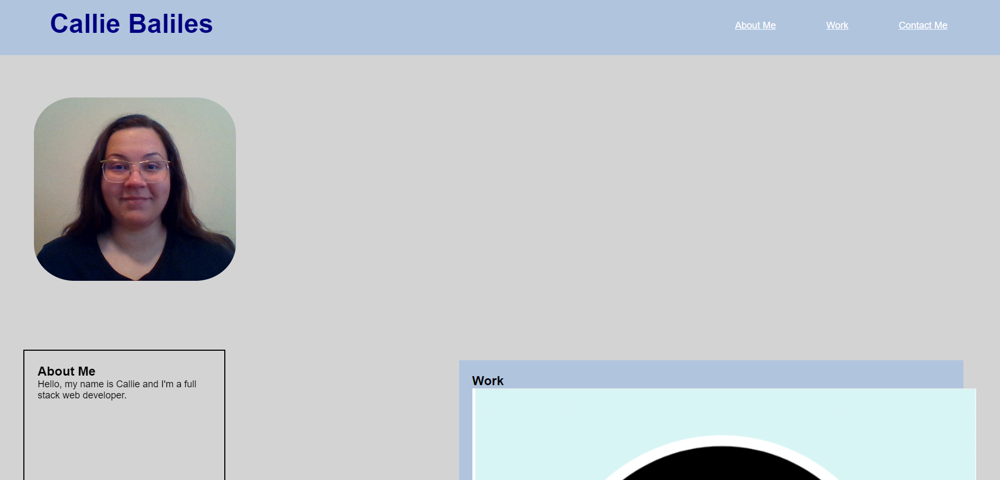

# week-2-challenge-portfolio

## Description

This portfolio is to showcase my projects to potential employers.
cription of how to get the development environment running.

## Usage
when you access the webpage, then you will be taken to my portfolio. when you access the navigation and click on the links it will take you to the corresponding section of the webpage.

## License

The last section of a high-quality README file is the license. This lets other developers know what they can and cannot do with your project. If you need help choosing a license, refer to [https://choosealicense.com/](https://choosealicense.com/).

